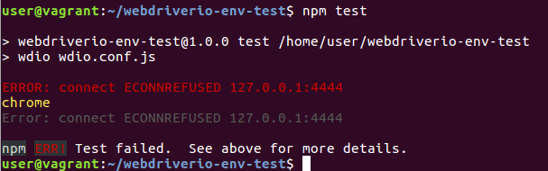

# 助教協助項目

* 協助學員環境安裝與排解
* 學員在做練習題時，若卡關很久，可以給提示。
* 若有一些與學員的互動對話，請將學員的問題下來與講師回覆的答案記錄。
* 學員複製完檔案後，隨身碟記得收回來，總共有 9 個。(原本說 10 個，但是有一個好像故障了，所以就...)

### 環境可能發生的問題

* Selenium Server 沒打開



```
webdriver-manage start
```

* Selenium Server 打開後還是有問題

更新瀏覽器驅動程式

```
webdriver-manage update
```

**測試環境的步驟**

* 先啟動 selenium server

```
webdriver-manager start
```

* 再啟動前端測試

```
cd ~/
npm test
```

### VM 異常

* [如何啟用 Intel VT-x 和 AMD SVM?](https://www.qnap.com/zh-hk/how-to/faq/article/%E5%A6%82%E4%BD%95%E5%95%9F%E7%94%A8-intel-vt-x-%E5%92%8C-amd-svm)

### 重新安裝 firefox

```
sudo apt-get -y remove firefox
sudo apt-get -y install firefox
```

### Firefox 異常

```
firefox -p
find ~/ -mount ! -user $(whoami)
sudo chown -hR user:user /home/user/.cache
sudo chown -hR user:user .mozilla/
```

### VM 環境

<https://github.com/agileworks-tw/desktop-jenkins2-vagrant/blob/ithome/e2e-workshop/Vagrantfile>

* 要切到 user 帳號
* 密碼：password

### C9 IDE

<http://localhost:9083>

### 練習題答案放置位置
