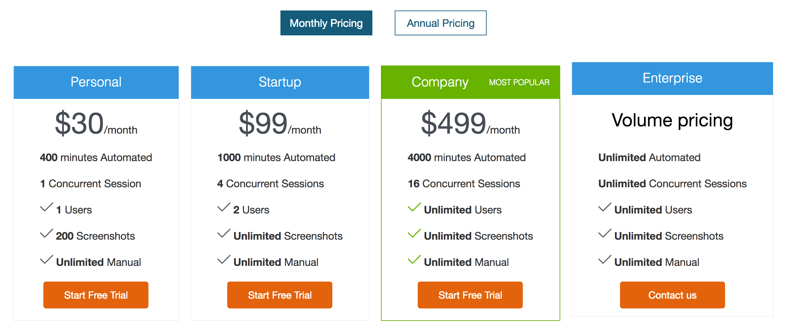

#  跨瀏覽器測試 (Cross Browser Testing)

```
ANDROID = {'platform': 'ANDROID', 'browserName': 'android', 'version': ''}
CHROME = {'platform': 'ANY', 'browserName': 'chrome', 'version': ''}
EDGE = {'platform': 'WINDOWS', 'browserName': 'MicrosoftEdge', 'version': ''}
FIREFOX = {'acceptInsecureCerts': True, 'browserName': 'firefox', 'marionette': True}
HTMLUNIT = {'platform': 'ANY', 'browserName': 'htmlunit', 'version': ''}
HTMLUNITWITHJS = {'platform': 'ANY', 'browserName': 'htmlunit', 'version': 'firefox', 'javascriptEnabled': True}
INTERNETEXPLORER = {'platform': 'WINDOWS', 'browserName': 'internet explorer', 'version': ''}
IPAD = {'platform': 'MAC', 'browserName': 'iPad', 'version': ''}
IPHONE = {'platform': 'MAC', 'browserName': 'iPhone', 'version': ''}
OPERA = {'platform': 'ANY', 'browserName': 'opera', 'version': ''}
PHANTOMJS = {'platform': 'ANY', 'browserName': 'phantomjs', 'version': '','javascriptEnabled': True}
SAFARI = {'platform': 'MAC', 'browserName': 'safari', 'version': ''}
```

### 介紹 [PhantomJS](<http://phantomjs.org/>)

* PhantomJS 無需瀏覽器的支持即可實現對 Web 的支持
* 快速入門：<http://phantomjs.org/quick-start.html>
* 範例：<http://phantomjs.org/examples/>
* [Install PhantomJS on Windows - YouTube](https://www.youtube.com/watch?v=L8Lw53MjDdY)

```
// 執行
phantomjs
```

```js
console.log('Loading a web page');
var page = require('webpage').create();
var url = 'http://phantomjs.org/';
page.open(url, function (status) {
  //Page is loaded!
  phantom.exit();
});
```
**適用場景**

* 作業系統沒有 GUI 環境
* 非常單純的測試

### 雲端瀏覽器測試


* SauceLabs: <https://saucelabs.com/>
* BrowserStack: <https://www.browserstack.com/>
* TestingBot: <https://testingbot.com/>

### 介紹 TestingBot

* 功能
* 價格方案

<https://testingbot.com/>


