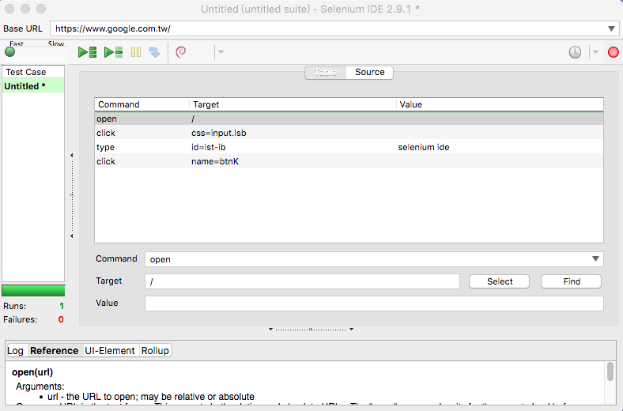

# 手動測試 vs 自動化測試

以自動化程度來劃分，可分成：

**手動測試 (Manual Testing)**

一個步驟一個步驟的手動去執行

**自動化測試 (Automation Testing)**

錄製測試步驟



撰寫自動化程式

```js
var webdriver = require('selenium-webdriver'),
    By = webdriver.By,
    until = webdriver.until;

var driver = new webdriver.Builder()
    .forBrowser('firefox')
    .build();

driver.get('http://www.google.com/ncr');
driver.findElement(By.name('q')).sendKeys('webdriver');
driver.findElement(By.name('btnG')).click();
driver.wait(until.titleIs('webdriver - Google Search'), 1000);
driver.quit();
```

**比較表**

項目 | 手動測試 | 自動化測試
---------------|-------------------
花費的時間 | 長 | 短
可測出的問題分佈 | 新功能的 bug | 已知的測試流程的 bug
同時測試數量  | 一次只能測一個 | 一次可以測多個

