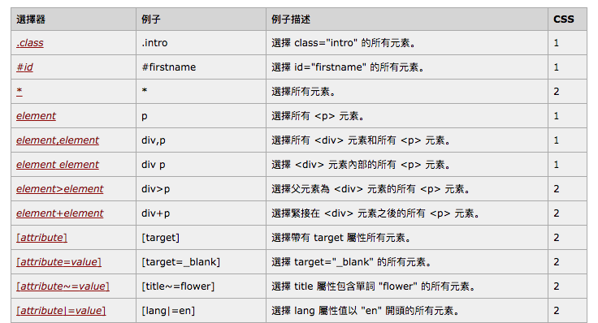
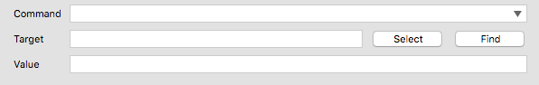

# 元素選取器

常見的英文稱呼叫：Target / Element Locators / Selector

### Identifier

identifier=id：選擇帶有特定 @id 屬性的元素。如果 @id 沒有找到元素，則會改以選擇 @name 中符合 id 的值。指令需要元素定位器為參數時，大多都是以此作為預設值。

```
id=myId
```

```html
<div id="myId">hello</div>
```

### Name

name=name：選擇帶有特定 @name 屬性的元素。

```html
<div name="myName">hello</div>
```

### DOM

dom=javascriptExpression：以 JavaScript 的方式選擇 DOM，開頭必定是 document.。例如 dom=document.images[2]。

```
dom=document.getElementById('loginForm')
dom=document.forms['loginForm']
dom=document.forms[0]
document.forms[0].username
document.forms[0].elements['username']
document.forms[0].elements[0]
document.forms[0].elements[3]
```

```html
<html>
  <body>
   <form id="loginForm">
    <input name="username" type="text" />
    <input name="password" type="password" />
    <input name="continue" type="submit" value="Login" />
    <input name="continue" type="button" value="Clear" />
   </form>
 </body>
 <html>
```

### XPath

xpath=xpathExpression：以 XPath 表示式來定位元素。

```
xpath=id('myId')
```

* [XPath Checker](https://addons.mozilla.org/en-US/firefox/addon/1095?id=1095)
* [W3Schools XPath Tutorial](http://www.w3schools.com/xml/xpath_intro.asp)

### Link Text

link=textPattern：選擇包含指定文字比對模式（text patterns）的連結（link）或錨點（anchor）元素，也就是<a>。

```
link=Continue
link=Cancel
```

```html
<html>
 <body>
  <p>Are you sure you want to do this?</p>
  <a href="continue.html">Continue</a>
  <a href="cancel.html">Cancel</a>
</body>
<html>
```

### Partial Link Text


```html
<html>
 <body>
  <p>Are you sure you want to do this?</p>
  <a href="continue.html">Continue</a>
  <a href="cancel.html">Go Home Page</a>
</body>
<html>
```

### CSS selector

css=cssSelectorSyntax：以 CSS 選擇器來選擇元素，請參考 CSS2 選擇器、CSS3 選擇器的說明。這應該是網頁工程師最容易使用的定位器吧。

```
css=form#loginForm
css=input[name="username"]
css=input.required[type="text"]
css=input.passfield
css=#loginForm input[type="button"]
css=#loginForm input:nth-child(2)
```

```html
<html>
  <body>
   <form id="loginForm">
    <input class="required" name="username" type="text" />
    <input class="required passfield" name="password" type="password" />
    <input name="continue" type="submit" value="Login" />
    <input name="continue" type="button" value="Clear" />
   </form>
 </body>
 <html>
```



* 補充工具的使用方式



## 延伸閱讀

* [CSS 選擇器參考手冊](http://www.w3school.com.cn/cssref/css_selectors.asp)
* [w3schools - css selectors](https://www.w3schools.com/cssref/css_selectors.asp)
* <http://flukeout.github.io/>