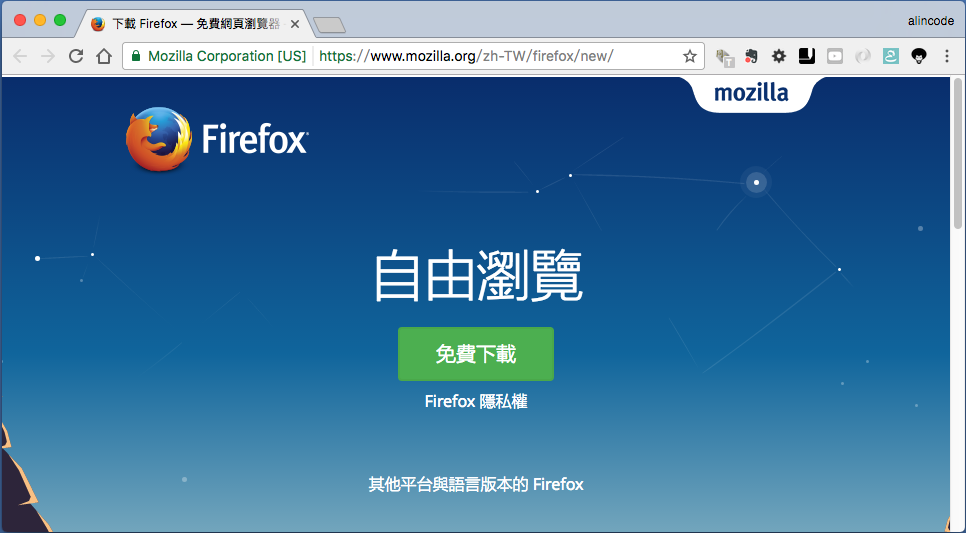

# 安裝環境指南

* JDK
* NPM
* Firefox & Selenium IDE (Option)

### 安裝 NPM

**下載軟體**

<https://nodejs.org/en/>


**測試安裝結果**

```
node -v
npm -v
```

### 安裝 Selenium IDE

第一步：首先你必須要安裝 [Firefox](https://www.mozilla.org/zh-TW/firefox/new/)



第二步：然後你必須要安裝 Selenium IDE，你可以至 <https://addons.mozilla.org/en-US/firefox/addon/selenium-ide/> 安裝它。


### 延伸閱讀

* <https://github.com/SeleniumHQ/selenium/tree/master/ide>