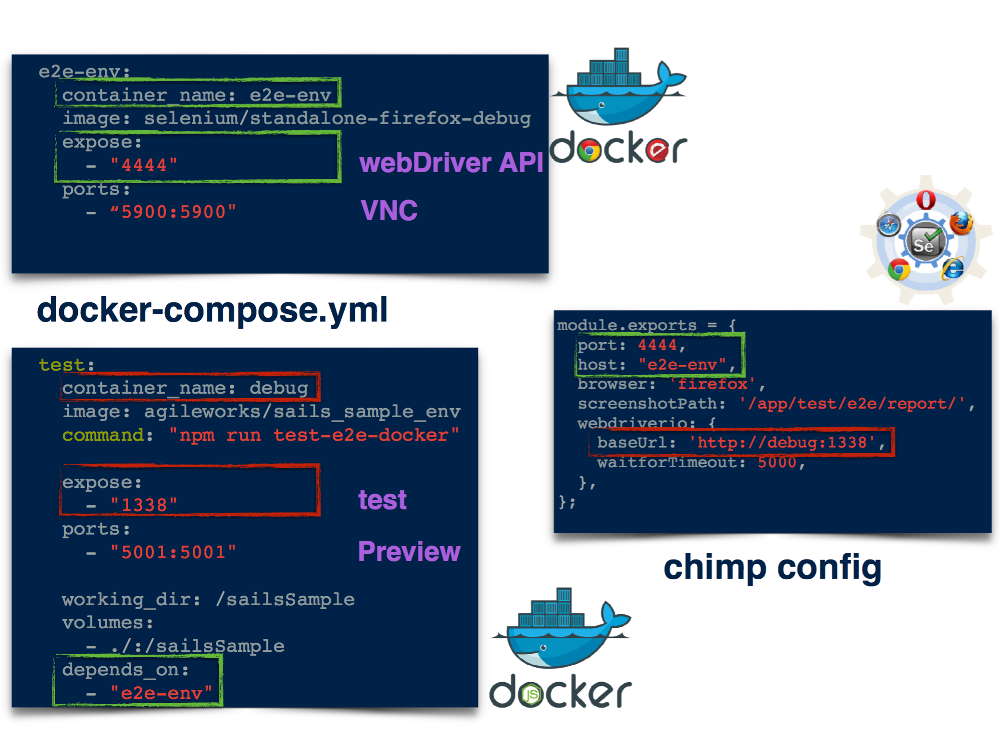

# Docker

<https://github.com/SeleniumHQ/docker-selenium>

### Images included:

* selenium/base: Base image which includes Java runtime and Selenium JAR file
* selenium/hub: Image for running a Selenium Grid Hub
* selenium/node-base: Base image for Selenium Grid Nodes which includes a virtual desktop environment and VNC support

**Selenium node**

* selenium/node-chrome: Selenium node with Chrome installed, needs to be connected to a Selenium Grid Hub
* selenium/node-firefox: Selenium node with Firefox installed, needs to be connected to a Selenium Grid Hub

**Selenium node + PhantomJS**

* selenium/node-phantomjs: Selenium node with PhantomJS installed, needs to be connected to a Selenium Grid Hub

**Selenium standalone**

* selenium/standalone-chrome: Selenium standalone with Chrome installed
* selenium/standalone-firefox: Selenium standalone with Firefox installed

**Selenium standalone + VNC server**

* selenium/standalone-chrome-debug: Selenium standalone with Chrome installed and runs a VNC server
* selenium/standalone-firefox-debug: Selenium standalone with Firefox installed and runs a VNC server

**Selenium Node + VNC server**

* selenium/node-chrome-debug: Selenium node with Chrome installed and runs a VNC server, needs to be connected to a Selenium Grid Hub
* selenium/node-firefox-debug: Selenium node with Firefox installed and runs a VNC server, needs to be connected to a Selenium Grid Hub

<!--
Xvfb 是什麼呢，他的名稱是 virtual framebuffer X server for X Version 11， Xvfb 可以直接處理 Window 的圖形化功能，並且不會把圖像輸出到螢幕上，也就是說，就算你的電腦沒有啟動 Xwindow ， 你仍然可以執行任何圖形程式。
-->

<!--
https://www.puritys.me/docs-blog/article-262-%E5%AE%89%E8%A3%9D-XVFB-%E5%81%9A-Selenium-%E6%B8%AC%E8%A9%A6.html
-->