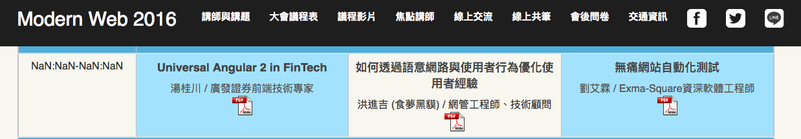

# 關於我(Alin)

[創科資訊](http://trunk-studio.com/) - 軟體技術顧問

具有實務上的 Web Full Stack 開發，及協助企業導入網站自動化測試實務經驗，熟悉 Java 及 Javascript 開發。是全端工程師、後端工程師、測試開發工程師、企業內訓講師，具有 7~8 年軟體開發相關資歷，目前從事企業技術教學與顧問。

### 擅長領域

* 網頁開發 (前端 + 後端 = 全端)
* 自動化測試開發
* 電子商務網站開發
* 第三方服務整合
* 系統分析 / 系統設計

### 教學 / 講師經歷

* 2016 Trunk studio - 講者 WebdriverIO 起手式
* 2017 企業內訓講師 / 大專院校業師 / 社群講者

**[2016 Modern Web 2016 講者](http://modernweb.tw/agenda.html#content)**

**[2016 JSDC.tw 講者](http://2016.jsdc.tw/agenda.html)**

**[2017 iThome 測試週講者](http://testing.ithome.com.tw)**

**[2017 網站測試開發 with WebdriverIO 實戰講堂](http://learning.ithome.com.tw/course/pUG31cbVpdA)**

