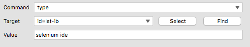

# Selenium IDE

安裝 Selenium IDE：[Selenium IDE :: Firefox 附加元件](https://addons.mozilla.org/zh-TW/firefox/addon/selenium-ide/)

### UI 功能

#### 功能列 (Toolbar)


快速 / 慢速執行


執行 Test Suit


執行 Test Case


錄影 (Record)


逐步執行


暫停 / 恢復


#### 面板

Log


使用文件


測試案例面板 (Test Case Pane)


#### 錄製一個測試案例

操作 Selenium IDE 就像錄影機，在開始「錄製」後，在瀏覽器操作網站的動作就會被捕捉，產生測試案例（Test Case）的內容。錄製完成後，可以用「播放」重新把網站操作過程重播一次。

這是使用 Selenium 進行網站自動化的基礎，以 Google 搜尋為例，建立一組測試案例包含：

1. 前往 <https://www.google.com.tw> 網址
1. 在文字輸入框輸入 `selenium ide`
1. 然後按下**Google 搜尋**按鈕
1. 取得搜尋結果，檢查結果是否包含預期的內容

### HTML 原始碼

```html
<input class="gsfi" id="lst-ib" maxlength="2048" name="q" autocomplete="off" title="搜尋" value="" aria-label="搜尋" aria-haspopup="false" role="combobox" aria-autocomplete="both" dir="ltr" spellcheck="false" type="text">
```

```html
<input value="Google 搜尋" aria-label="Google 搜尋" name="btnK" jsaction="sf.chk" type="submit">
```

<!-- 開啟 Firebug 解說 -->

### Selenium 指令

**命令組成**



* 指令 (Command)：行為 / 事件
* 目標 (Target)：選取元素
* 值 (Value)

**指令的種類**

* 操作（Actions）
* 存取（Accessors）
* 驗證（Assertions）

#### 操作（Actions）

**open：前往某個頁面**


命令 (Command) | 目標 (Target) | 值 (Value)
---------|----------|---------
 open    | /test    | 
 open    | http://demoqa.com | 

**click：模擬點擊一下**

命令 (Command) | 目標 (Target) | 值 (Value)
--------------|----------|---------
 click        | myCheckbox | 
 clickAndWait | mySubmitButton | 
 clickAndWait | myLike | 

**type：模擬鍵盤輸入**

命令 (Command) | 目標 (Target) | 值 (Value)
--------------|----------|---------
 type         | myField | Hi
 typeAndWait  | myField | Hi
 
**select：模擬選取**

命令 (Command)  | 目標 (Target) | 值 (Value)
---------------|------------------|---------
 select        | id=entry_1000004 | label=Firefox
 select        | dropDown         | index=0
 select        | dropDown         | value=AUD
 selectAndWait | dropDown         | index=0
 selectAndWait | dropDown         | value=AUD

**pause**

* 暫停
* 單位是毫秒

命令 (Command) | 目標 (Target) | 值 (Value)
--------------|----------|---------
 pause | 5000 | 

#### 存取（Accessors）

* storeText
* storeTitle
* store

命令 (Command) | 目標 (Target) | 值 (Value)
--------------|----------|---------
 store | alincode@gmail.com | myEmail

命令 (Command) | 目標 (Target) | 值 (Value)
--------------|----------|---------
 type | id=email | ${myEmail}


#### 驗證（Assertions）

* 驗證（assert）/ 辨識（verify）
  * assertText / verifyText
  * assertTitle / verifyTitle
  * assertAlert / verifyAlert
  * assertTextPresent / verifyTextPresent
  * assertElementPresent / verifyElementPresent
  * assertTable / verifyTable
* 等待（waitFor）
  * waitForText
  * waitForPageToLoad
  * waitForElementPresent

**驗證（assert）vs 辨識（verify）**

<!-- 停下來示範 -->


差別在於處理錯誤的方式

* 驗證（assert）發生錯誤時，測試將會終止。
* 辨識（verify）：發生錯誤時，只是將錯誤訊息留下記錄，測試將會繼續執行不會中斷。
  * 使用情境：不影響整體測試流程的小細節

**verifyText**

* 驗證文字

命令 (Command)  | 目標 (Target) | 值 (Value)
---------------|------------------|---------
 verifyText    | xpath=/html/body/div[2]/div/p | 驗證的文字
 verifyText    | //html/body/div[2]/div/p | 驗證的文字

**verifyAllWindowTitles**

* 驗證視窗標題

命令 (Command)  | 目標 (Target) | 值 (Value)
------------------------|------------------|---------
 verifyAllWindowTitles  | Google | 

#### 等待（waitFor）

等待某些情況發生時才生效，常用於非同步 (AJAX)。

**waitForAllWindowTitle**

* 等待視窗指定標題出現

命令 (Command)  | 目標 (Target) | 值 (Value)
------------------------|------------------|---------
 waitForAllWindowTitle  | 您的標題 | 

<!--
### 擴充指令


-->

### 延伸閱讀

* [Selenium-IDE — Selenium Documentation](http://docs.seleniumhq.org/docs/02_selenium_ide.jsp)
* [Selenium Assert vs Verify Commands and how to use in automation - YouTube](https://www.youtube.com/watch?v=iw_NDJsLYt8)
