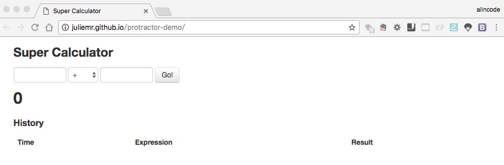
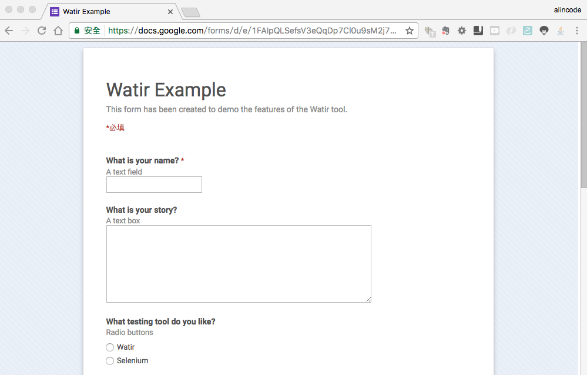
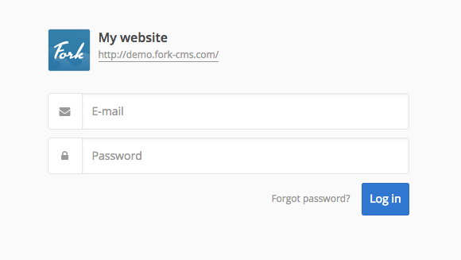

# Selenium IDE 實戰練習

### 練習一：測試計算機

* 供測試的網站：<http://juliemr.github.io/protractor-demo/>
* 學習重點：熟悉基本指令

### 練習二：錄製一個自動填寫表單的程式

* 供測試的網站：<http://bit.ly/watir-example>
* 學習重點：跨頁面測試

### 練習三：登入和登出

練習目的：加入驗證點

* 供測試的網站：<http://demo.fork-cms.com/private/>
* 帳號：demo@fork-cms.com
* 密碼：demo

