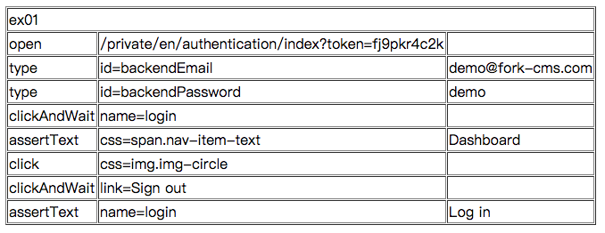

# Selenium IDE 實戰練習

### 練習一：錄製一個自動填寫表單的程式

練習目的：熟練錄製方式

* 可供測試的網站：<http://bit.ly/watir-example>

### 練習二：登入和登出

練習目的：手動編輯指令，加入驗證點

* <http://demo.fork-cms.com/private/>
* 帳號：demo@fork-cms.com
* 密碼：demo

### 答案

### 練習三：新增帳號

練習目的：更複雜的測試邏輯

### 答案

### 延伸閱讀

* <http://www.fork-cms.com/demo>
