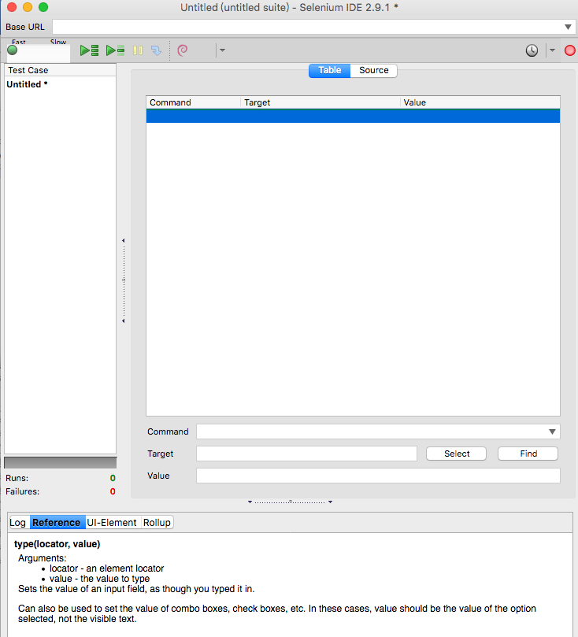

### Selenium IDE UI

### 功能列 (Toolbar)

快速 / 慢速執行

執行 Test Suit

執行 Test Case

錄影 (Record)

逐步執行

暫停 / 恢復

### 面板

Log

使用文件

測試案例面板 (Test Case Pane)

### 示範

* 建立新的測試案例 (Test Case)
  * 一個 Test Case 名稱叫做 test case 1
  * 一個 Test Case 名稱叫做 test case 2
* 分別儲存 Test Case
* 儲存測試集合 (Test Suit)
* 刪除 Test Case
* 添加 Test Case
* 切換 Test Case
* 錄影 <http://demoqa.com/>
* 設定中斷點 / 移除中斷點
* 逐步執行
* 恢復
