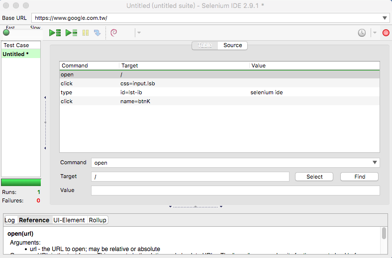

# Selenium IDE

Selenium IDE 是 Firefox 附加元件 (extension)，需要搭配 Firefox 瀏覽器才能使用。

### 安裝 Selenium IDE

1. 首先你必須要安裝 [Firefox](https://www.mozilla.org/zh-TW/firefox/new/)
1. 然後你必須要安裝 Selenium IDE，你可以至 <https://addons.mozilla.org/en-US/firefox/addon/selenium-ide/> 安裝它。

### 開啟 Selenium IDE

在 Firefox 瀏覽器的**工具**選單，打開 **Selenium IDE** 會出現下面這個視窗畫面：



### 重要觀念

* 命令 (Command)：針對選取的元素做出一些行為
* 目標 (Target)：選取元素
* 值 (Value)

<!-- 開啟 Firebug -->

### 錄製一個測試案例

操作 Selenium IDE 就像錄影機，在開始「錄製」後，在瀏覽器操作網站的動作就會被捕捉，產生測試案例（Test Case）的內容。錄製完成後，可以用「播放」重新把網站操作過程重播一次。

這是使用 Selenium 進行網站自動化的基礎，以 Google 搜尋為例，建立一組測試案例包含：

1. 前往 <https://www.google.com.tw> 網址
1. 在文字輸入框輸入 `selenium ide`
1. 然後按下**Google 搜尋**按鈕
1. 取得搜尋結果，檢查結果是否包含預期的內容

<!-- 留一點時間讓大家練習看看 -->

### HTML 原始碼

```html
<input class="gsfi" id="lst-ib" maxlength="2048" name="q" autocomplete="off" title="搜尋" value="" aria-label="搜尋" aria-haspopup="false" role="combobox" aria-autocomplete="both" dir="ltr" spellcheck="false" type="text">
```

```html
<input value="Google 搜尋" aria-label="Google 搜尋" name="btnK" jsaction="sf.chk" type="submit">
```

### 常用命令

**open**

前往某個頁面

命令 (Command) | 目標 (Target) | 值 (Value)
---------|----------|---------
 open    | /test    | 
 open    | http://www.google.com.tw/test | 

**click**

模擬點擊一下

命令 (Command) | 目標 (Target) | 值 (Value)
--------------|----------|---------
 click        | myCheckbox | 
 clickAndWait | mySubmitButton | 
 clickAndWait | myLike | 

**type**

模擬鍵盤輸入

命令 (Command) | 目標 (Target) | 值 (Value)
--------------|----------|---------
 type         | myField | Hi
 typeAndWait  | myField | Hi

**select**

模擬選取

命令 (Command)  | 目標 (Target) | 值 (Value)
---------------|------------------|---------
 select        | id=entry_1000004 | label=Firefox
 select        | dropDown         | index=0
 select        | dropDown         | value=AUD
 selectAndWait | dropDown         | index=0
 selectAndWait | dropDown         | value=AUD

**pause**

* 暫停
* 單位是毫秒

命令 (Command) | 目標 (Target) | 值 (Value)
--------------|----------|---------
 pause | 5000 | 


### 練習題

* 安裝 Selenium IDE
* 錄製一個簡單的 Google 搜尋測試案例

### 延伸閱讀

* [Selenium IDE :: Firefox 附加元件](https://addons.mozilla.org/zh-TW/firefox/addon/selenium-ide/)
* [Selenium-IDE — Selenium Documentation](http://docs.seleniumhq.org/docs/02_selenium_ide.jsp)
