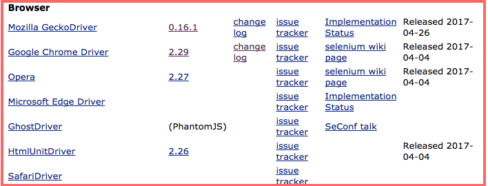
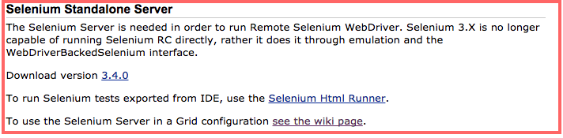

# 設定 Selenium Server 環境

* 下載並設定，各種版本的瀏覽器與 selenium 對應的驅動程式。
* 下載並執行，Selenium Server。

### 安裝瀏覽器驅動程式 (driver)

至 http://www.seleniumhq.org/download/ 下載



### 安裝 Selenium Server

#### 方法一

至 <http://www.seleniumhq.org/download/> 下載 selenium-server-standalone-3.4.0.jar 檔



#### 方法二

```
// 安裝 webdriver-manager 模組到全域環境
npm install webdriver-manager -g

// 更新 driver
webdriver-manager update
```

### 執行 Selenium Server

#### 方法一

```
java -jar selenium-server-standalone-3.4.0.jar
```

<http://127.0.0.1:4444/wd/hub>

#### 方法二

```
// 啟動 selenium server
webdriver-manager start

// 查看 driver 狀態
webdriver-manager status

// 清除 driver
webdriver-manager clean
```