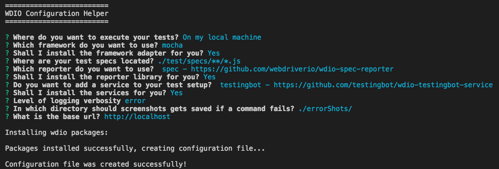

# WebdriverIO 初始化專案

```
// 新增空的專案資料夾
mkdir demo

cd demo

// 初始化 npm 專案
npm init -y

// 安裝 webdriverio 模組
npm install webdriverio --save-dev
```

### 產生 Webdriverio 設定檔



```
// 執行 CLI (Mac)
$ node_modules/.bin/wdio

// 執行 CLI (Window)
$ node_modules\.bin\wdio

=========================
WDIO Configuration Helper
=========================

選擇你的執行環境
? Where do you want to execute your tests? On my local machine

選擇你要使用的測試框架
? Which framework do you want to use? mocha

你要安裝測試框架的 adapter 嗎？
? Shall I install the framework adapter for you? Yes

設定你預計測試程式放置的資料夾位置
? Where are your test specs located? 

選擇你想要的報表格式
? Which reporter do you want to use?

你要安裝報表函式庫嗎？
? Shall I install the reporter library for you? 

你想要新增服務到你的測試專案嗎？
? Do you want to add a service to your test setup?

你要安裝服務嗎？
? Shall I install the services for you?

設定 log 的層級
? Level of logging verbosity silent

設定測試失敗後，截圖放置位置
? In which directory should screenshots gets saved if a command fails?

設定將要測試的網站的 domain url
? What is the base url? 
```

### 執行方式

1. 編輯 `package.json`
2. 把 script test 指令設定為 `wdio wdio.conf.js`
3. 執行 `npm test`